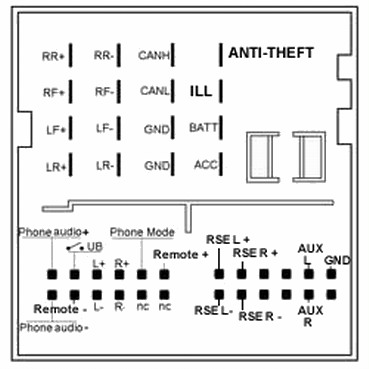

# Reverse engineering CANbus messages of Fiesta MK5 dashboard/radio subsystem
This documentation applies to Ford Fiesta MK5 >2006 (MK5 restyling), with 2-DIN, 6000CD radio.

The radio sends messages to the LCD screen in the dashboard, like FM station names, CD track IDs, volume changes.

The idea was to tap into the text-to-LCD mechanism, but I ended up reversing some other interesting CANbus messages.

Tapping in the infotaiment CANbus is quite easy: just connect a CANbus interface over CANH and CANL lines that come into the QuadLock conector of the radio, no 120 Ohm terminal block resistor needed.

Personally, I used a [SeedStudio CANbus Shield](https://wiki.seeedstudio.com/CAN-BUS_Shield_V2.0/) stacked onto an Arduino Uno R3. 

## Results
Bus speed is 125 KBPS.

### Text to LCD screen
The radio sends text to the dashboard LCD using either a short message format or an extended message format. 

The short format can only be seen whenever the radio switches to AUX mode.

<table class="tg">
<thead>
  <tr>
    <th class="tg-c3ow">ID</th>
    <th class="tg-c3ow">1</th>
    <th class="tg-c3ow">2</th>
    <th class="tg-c3ow">3</th>
    <th class="tg-c3ow">4</th>
    <th class="tg-c3ow">5</th>
    <th class="tg-c3ow">6</th>
    <th class="tg-c3ow">7</th>
    <th class="tg-c3ow">8</th>
  </tr>
</thead>
<tbody>
  <tr>
    <td class="tg-c3ow">0x4C0</td>
    <td class="tg-c3ow">0x7</td>
    <td class="tg-c3ow">0x34</td>
    <td class="tg-c3ow" colspan="6">ASCII text</td>
  </tr>
</tbody>
</table>

The extended format is composed by one header message containing the length of the text, and subsequent messages that provide additional text portions.

<table class="tg">
<thead>
  <tr>
    <th class="tg-c3ow">ID</th>
    <th class="tg-c3ow">1</th>
    <th class="tg-c3ow">2</th>
    <th class="tg-c3ow">3</th>
    <th class="tg-c3ow">4</th>
    <th class="tg-c3ow">5</th>
    <th class="tg-c3ow">6</th>
    <th class="tg-c3ow">7</th>
    <th class="tg-c3ow">8</th>
  </tr>
</thead>
<tbody>
  <tr>
    <td class="tg-c3ow">0x4C0</td>
    <td class="tg-c3ow">0x10</td>
    <td class="tg-c3ow">Text length + 2</td>
    <td class="tg-c3ow">0x34</td>
    <td class="tg-c3ow" colspan="5">ASCII text</td>
  </tr>
  <tr>
    <td class="tg-0pky">0x4C0</td>
    <td class="tg-0pky">0x21</td>
    <td class="tg-0pky" colspan="7">ASCII text</td>
  </tr>
</tbody>
</table>

### Radio OFF
When the radio is OFF this message is broadcasted.
<table class="tg">
<thead>
  <tr>
    <th class="tg-c3ow">ID</th>
    <th class="tg-c3ow">1</th>
    <th class="tg-c3ow">2</th>
    <th class="tg-c3ow">3</th>
    <th class="tg-c3ow">4</th>
    <th class="tg-c3ow">5</th>
    <th class="tg-c3ow">6</th>
    <th class="tg-c3ow">7</th>
    <th class="tg-c3ow">8</th>
  </tr>
</thead>
<tbody>
  <tr>
    <td class="tg-c3ow">0x4C0</td>
    <td class="tg-c3ow">0x2</td>
    <td class="tg-c3ow">0x34</td>
    <td class="tg-c3ow" colspan="6">0</td>
  </tr>
</tbody>
</table>

### Date & Time
The car has an onboard RTC that works independently from the radio clock (it works even if the radio is disconnected at all). The date and time are broadcasted with 1 second resolution.
<table class="tg">
<thead>
  <tr>
    <th class="tg-c3ow">ID</th>
    <th class="tg-c3ow">1</th>
    <th class="tg-c3ow">2</th>
    <th class="tg-c3ow">3</th>
    <th class="tg-c3ow">4</th>
    <th class="tg-c3ow">5</th>
    <th class="tg-c3ow">6</th>
  </tr>
</thead>
<tbody>
  <tr>
    <td class="tg-c3ow">0x80</td>
    <td class="tg-c3ow">year (two digits)</td>
    <td class="tg-c3ow">month</td>
    <td class="tg-c3ow">day</td>
    <td class="tg-c3ow">hours</td>
    <td class="tg-c3ow">minutes</td>
    <td class="tg-c3ow">seconds</td>
  </tr>
</tbody>
</table>
